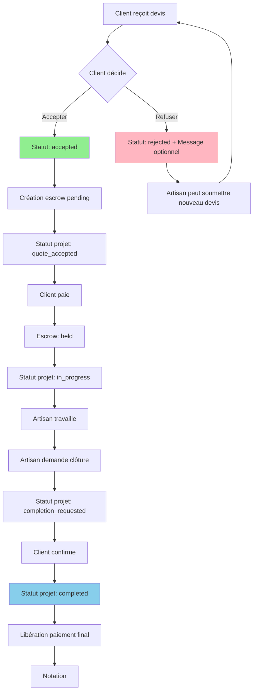

# 📐 DOCUMENT DE CONCEPTION - REFONTE WORKFLOW PROJET

## Analyse du workflow actuel et nouvelle architecture optimisée

**Date :** 2025-01-XX  
**Version :** 1.0.0  
**Statut :** Conception → Implémentation

---

## 📋 TABLE DES MATIÈRES

1. [Contexte et objectifs](#1-contexte-et-objectifs)
2. [Analyse du workflow actuel](#2-analyse-du-workflow-actuel)
3. [Problèmes identifiés](#3-problèmes-identifiés)
4. [Nouvelle architecture proposée](#4-nouvelle-architecture-proposée)
5. [Workflow optimisé détaillé](#5-workflow-optimisé-détaillé)
6. [Éléments à supprimer](#6-éléments-à-supprimer)
7. [Éléments à créer/modifier](#7-éléments-à-créermodifier)
8. [Plan d'implémentation](#8-plan-dimplémentation)
9. [Diagrammes de flux](#9-diagrammes-de-flux)
10. [Spécifications techniques](#10-spécifications-techniques)

---

## 1. CONTEXTE ET OBJECTIFS

### 1.1 Objectif Principal

Supprimer la logique de révision et refondre complètement le workflow depuis la réception du devis jusqu'à la clôture du projet pour :
- ✅ Simplifier le parcours utilisateur
- ✅ Réduire les points de friction
- ✅ Améliorer l'expérience client et artisan
- ✅ Respecter les bonnes pratiques
- ✅ Répondre aux attentes du client donneur d'ordre

### 1.2 Périmètre

**Zone à refondre :** Du moment où le client reçoit le devis jusqu'à la clôture du projet  
**Zone à conserver :** Tout ce qui précède l'envoi du devis (création projet, soumission devis initial)

---

## 2. ANALYSE DU WORKFLOW ACTUEL

### 2.1 Workflow Actuel (avec révision)

```
1. Client reçoit devis (status: pending/viewed)
   ↓
2. Client peut choisir parmi 3 actions :
   a) Accepter le devis → Acceptation (suite à l'étape 3)
   b) Refuser le devis → Rejection
   c) Demander une révision → Révision demandée
   ↓
3a. Si Acceptation :
    → Statut devis: accepted
    → Statut projet: quote_accepted
    → Création escrow (pending)
    → Notification artisan
    → Client doit payer
    → Escrow passe à held après paiement
    → Statut projet: in_progress
    → Artisan travaille
    → Artisan demande clôture
    → Statut projet: completion_requested
    → Client confirme clôture
    → Statut projet: completed
    → Libération paiement final
    → Notation

3b. Si Révision demandée :
    → Statut devis: revision_requested
    → Notification artisan avec détails
    → Artisan voit demande de révision
    → Artisan peut :
       - Accepter et proposer nouveau devis (revised)
       - Refuser la révision (abandoned)
    → Si accepté : Nouveau devis soumis (status: pending)
    → Client peut accepter/refuser/demander nouvelle révision
    → Boucle possible jusqu'à acceptation ou abandon
```

### 2.2 Statuts Actuels (à simplifier)

**Statuts projets :**
- `draft`, `open`, `quote_received`, `quote_accepted`, `payment_pending`, `in_progress`, `completion_requested`, `disputed`, `completed`, `cancelled`, `expired`

**Statuts devis (avec révision) :**
- `pending`, `viewed`, `accepted`, `rejected`, `revision_requested`, `revised`, `expired`, `abandoned`

**Statuts escrow :**
- `pending`, `held`, `advance_paid`, `released`, `frozen`, `refunded`

---

## 3. PROBLÈMES IDENTIFIÉS

### 3.1 Complexité Inutile

- ❌ Workflow de révision fragmenté et source de confusion
- ❌ Multiplication des statuts (`revision_requested`, `revised`)
- ❌ Logique conditionnelle complexe dans le code
- ❌ UI fragmentée (RevisionPage séparée, sections révision dans ProjectDetailsPage)

### 3.2 Expérience Utilisateur Dégradée

- ❌ Client : confusion entre "révision" et "nouveau devis"
- ❌ Artisan : parcours non linéaire avec page dédiée
- ❌ Manque de clarté sur les actions possibles

### 3.3 Maintenance Difficile

- ❌ Code dispersé dans plusieurs fichiers
- ❌ Logique conditionnelle difficile à tester
- ❌ Risque d'incohérences entre statuts

---

## 4. NOUVELLE ARCHITECTURE PROPOSÉE

### 4.1 Principe Fondamental

**Remplacement de la "révision" par un "nouveau devis" naturel**

- Un client insatisfait **refuse** le devis et peut donner des explications (optionnel)
- L'artisan peut soumettre un **nouveau devis** en tenant compte des explications
- Pas de mécanisme spécial de révision, juste le flux normal de devis

### 4.2 Avantages

✅ **Simplicité** : Un seul flux de devis  
✅ **Clarté** : Action immédiate (accepter ou refuser)  
✅ **Flexibilité** : L'artisan peut soumettre plusieurs devis  
✅ **Maintenabilité** : Code plus simple et testable

---

## 5. WORKFLOW OPTIMISÉ DÉTAILLÉ

### 5.1 Nouveau Workflow Simplifié



### 5.2 Étapes Détaillées

#### **Étape 1 : Client reçoit devis**
- Devis avec `status: pending` ou `viewed`
- Affichage dans ProjectDetailsPage
- Actions disponibles : **Accepter** / **Refuser**

#### **Étape 2a : Client accepte le devis**
- Statut devis → `accepted`
- Statut projet → `quote_accepted`
- Création automatique escrow (`pending`)
- Notification artisan : "Devis accepté ! En attente du paiement"
- Autres devis → `rejected` automatiquement
- Affichage EscrowBanner pour paiement

#### **Étape 2b : Client refuse le devis**
- Statut devis → `rejected`
- **Optionnel** : Message/raison du refus (via modal ou commentaire)
- Notification artisan : "Devis refusé" + message si fourni
- Projet reste `open` ou `quote_received`
- Artisan peut soumettre un nouveau devis

#### **Étape 3 : Paiement (si acceptation)**
- Client paie via EscrowBanner
- Escrow → `held`
- Statut projet → `in_progress` (automatique après paiement)
- Notification artisan : "Paiement reçu ! Vous pouvez commencer"

#### **Étape 4 : Travaux en cours**
- Statut projet : `in_progress`
- Chat disponible
- Artisan peut demander clôture

#### **Étape 5 : Clôture**
- Artisan demande clôture
- Statut projet → `completion_requested`
- Notification client
- Client confirme clôture
- Statut projet → `completed`
- Libération paiement final
- Modal de notation

---

## 6. ÉLÉMENTS À SUPPRIMER

### 6.1 Fichiers Complets à Supprimer

1. ✅ `src/pages/RevisionPage.tsx` - Page dédiée aux révisions
2. ✅ `src/components/RevisionRequest.tsx` - Composant demande de révision

### 6.2 Fonctions/Services à Supprimer

**Dans `src/lib/notificationService.ts` :**
- ✅ `notifyArtisanRevisionRequested()` - Remplacé par notification de refus avec message

**Dans `src/components/NotificationBell.tsx` :**
- ✅ Case `revision_requested` dans `handleNotificationClick`

**Dans `src/App.tsx` :**
- ✅ Route `/revisions/:quoteId`

### 6.3 Code à Supprimer dans ProjectDetailsPage.tsx

- ✅ Toute la logique de révision (lignes ~340-375 : scroll vers révision)
- ✅ Section révision dans l'affichage des devis (lignes ~1476-1503 : RevisionRequest modal)
- ✅ Affichage des détails de révision (lignes ~1626-1695 : Section révision dans devis)
- ✅ Boutons d'action pour révision (lignes ~1860-1901 : Actions artisan pour révision)
- ✅ `allRevisions` useMemo (lignes ~400-406)
- ✅ État `revisionQuoteId` et sa gestion
- ✅ Import `RevisionRequest`

### 6.4 Code à Supprimer dans QuoteForm.tsx

- ✅ Prop `revisionQuoteId` de `QuoteFormProps`
- ✅ Logique de mise à jour du devis original en "revised" (lignes ~247-279)
- ✅ Affichage conditionnel "Répondre à la révision" (lignes ~344-392)

### 6.5 Code à Supprimer dans Dashboard.tsx

- ✅ Affichage badge "Révision demandée" (lignes ~723-732)
- ✅ Compteur de révisions dans `urgentCount` (si présent)

### 6.6 Statuts à Supprimer (Base de Données)

**À supprimer de l'enum `quote_status` :**
- `revision_requested`
- `revised`

**Note :** Migration SQL nécessaire pour convertir les devis existants :
- `revision_requested` → `rejected`
- `revised` → `pending` (ou `rejected` selon contexte)

### 6.7 Champs de Table à Supprimer (Optionnel)

**Dans table `quotes` :**
- `revision_reason` → À remplacer par un champ générique `rejection_reason` ou `client_comment`
- `client_suggested_price` → À supprimer ou déplacer dans un autre contexte
- `client_audio_url` → À supprimer ou déplacer
- `revision_count` → À supprimer

**Note :** Ces champs peuvent être conservés pour les données historiques, mais ne plus être utilisés.

---

## 7. ÉLÉMENTS À CRÉER/MODIFIER

### 7.1 Nouvelles Fonctionnalités

#### **7.1.1 Refus de devis avec message optionnel**

**Fichier :** `src/pages/ProjectDetailsPage.tsx`

**Modification de `handleRejectQuote` :**
- Ajouter un modal pour saisir la raison du refus (optionnel)
- Si raison fournie, l'enregistrer dans un nouveau champ `rejection_reason`
- Notification artisan avec message si fourni

**Composant à créer :** `src/components/RejectionModal.tsx`
- Modal simple avec textarea pour raison (optionnelle)
- Boutons : "Refuser sans raison" / "Refuser avec raison"

#### **7.1.2 Amélioration de la notification de refus**

**Fichier :** `src/lib/notificationService.ts`

**Modifier `notifyArtisanQuoteRejected` :**
- Ajouter paramètre `rejectionReason`
- Inclure la raison dans le message si fournie
- Ajouter guidance : "Vous pouvez soumettre un nouveau devis"

### 7.2 Modifications des Composants Existants

#### **7.2.1 ProjectDetailsPage.tsx**

**Modifications principales :**
1. Supprimer toute la logique de révision
2. Simplifier l'affichage des devis (pas de section révision)
3. Ajouter RejectionModal pour le refus avec raison
4. Améliorer l'affichage des devis rejetés avec raison si disponible

#### **7.2.2 QuoteForm.tsx**

**Modifications :**
1. Supprimer prop `revisionQuoteId`
2. Supprimer logique de mise à jour devis original
3. Simplifier l'affichage (toujours "Nouveau devis" ou "Modifier devis")

#### **7.2.3 Dashboard.tsx**

**Modifications :**
1. Supprimer badge "Révision demandée"
2. Simplifier l'affichage des devis rejetés (afficher raison si disponible)

### 7.3 Migrations Base de Données

#### **Migration 1 : Supprimer statuts révision**

```sql
-- Migration: Supprimer statuts revision_requested et revised

-- 1. Convertir les devis existants
UPDATE quotes 
SET status = 'rejected' 
WHERE status = 'revision_requested';

UPDATE quotes 
SET status = 'pending' 
WHERE status = 'revised' AND created_at > NOW() - INTERVAL '7 days';
-- Les devis révisés récents deviennent pending, les anciens rejected

UPDATE quotes 
SET status = 'rejected' 
WHERE status = 'revised' AND created_at <= NOW() - INTERVAL '7 days';

-- 2. Modifier l'enum (nécessite recréation de l'enum)
-- Créer nouveau enum sans revision_requested et revised
CREATE TYPE quote_status_new AS ENUM (
  'pending', 
  'viewed', 
  'accepted', 
  'rejected', 
  'expired', 
  'abandoned'
);

-- 3. Convertir colonne
ALTER TABLE quotes 
ALTER COLUMN status TYPE quote_status_new 
USING status::text::quote_status_new;

-- 4. Renommer
DROP TYPE quote_status;
ALTER TYPE quote_status_new RENAME TO quote_status;
```

#### **Migration 2 : Ajouter champ rejection_reason (optionnel)**

```sql
-- Migration: Ajouter champ rejection_reason et migrer données

-- 1. Ajouter nouveau champ
ALTER TABLE quotes 
ADD COLUMN IF NOT EXISTS rejection_reason TEXT;

-- 2. Migrer données existantes (si revision_reason existe)
UPDATE quotes 
SET rejection_reason = revision_reason 
WHERE revision_reason IS NOT NULL 
AND (status = 'rejected' OR status = 'revision_requested');

-- 3. Optionnel: Renommer ou supprimer ancien champ
-- ALTER TABLE quotes DROP COLUMN revision_reason; (après migration)
```

---

## 8. PLAN D'IMPLÉMENTATION

### Phase 1 : Préparation ✅
- [x] Analyse du workflow actuel
- [x] Identification des éléments à supprimer
- [x] Création du document de conception
- [x] Validation avec le client

### Phase 2 : Migrations Base de Données (1h)
- [ ] Créer migration pour convertir statuts existants
- [ ] Créer migration pour ajouter `rejection_reason` (optionnel)
- [ ] Tester migrations sur base de test
- [ ] Appliquer migrations en production

### Phase 3 : Suppression Code Révision (2h)
- [ ] Supprimer `RevisionPage.tsx`
- [ ] Supprimer `RevisionRequest.tsx`
- [ ] Supprimer route dans `App.tsx`
- [ ] Supprimer logique révision dans `ProjectDetailsPage.tsx`
- [ ] Supprimer prop `revisionQuoteId` dans `QuoteForm.tsx`
- [ ] Supprimer notification `notifyArtisanRevisionRequested`

### Phase 4 : Création Nouvelles Fonctionnalités (2h)
- [ ] Créer `RejectionModal.tsx`
- [ ] Modifier `handleRejectQuote` pour utiliser le modal
- [ ] Améliorer `notifyArtisanQuoteRejected` avec raison
- [ ] Ajouter affichage `rejection_reason` dans les devis rejetés

### Phase 5 : Tests et Validation (1h)
- [ ] Tester le nouveau workflow complet
- [ ] Tester le refus avec raison
- [ ] Tester la soumission d'un nouveau devis après refus
- [ ] Vérifier les notifications
- [ ] Vérifier les migrations de données

### Phase 6 : Nettoyage Final (30 min)
- [ ] Supprimer code mort
- [ ] Nettoyer les imports
- [ ] Vérifier les erreurs TypeScript
- [ ] Mettre à jour la documentation

**Temps total estimé : ~7h**

---

## 9. DIAGRAMMES DE FLUX

### 9.1 Nouveau Workflow Simplifié (Diagramme Détaillé)

Voir section 5.1 pour le diagramme Mermaid complet.

### 9.2 Comparaison Avant/Après

**AVANT (avec révision) :**
```
Devis → [Accepter | Refuser | Révision] → Si Révision → Nouvelle page → Nouveau devis → [Accepter | Refuser | Révision] → ...
```

**APRÈS (simplifié) :**
```
Devis → [Accepter | Refuser avec message] → Si Refus → Nouveau devis possible → [Accepter | Refuser avec message] → ...
```

---

## 10. SPÉCIFICATIONS TECHNIQUES

### 10.1 Nouveaux Composants

#### **RejectionModal.tsx**

```typescript
interface RejectionModalProps {
  open: boolean;
  onClose: () => void;
  onConfirm: (reason?: string) => void;
  quoteAmount: number;
  artisanName: string;
}
```

**Fonctionnalités :**
- Modal avec textarea pour raison (optionnelle)
- Boutons : "Refuser sans raison" / "Refuser avec raison"
- Validation : raison optionnelle mais si saisie, min 10 caractères

### 10.2 Modifications API

**Endpoint : Rejeter un devis**
- `PATCH /quotes/:id`
- Body : `{ status: 'rejected', rejection_reason?: string }`
- Notification automatique à l'artisan

### 10.3 Schéma Base de Données

**Table `quotes` (modifications) :**
- Supprimer : `revision_reason`, `revision_count`, `client_suggested_price`, `client_audio_url`
- Ajouter (optionnel) : `rejection_reason TEXT`

**Enum `quote_status` :**
- Supprimer : `revision_requested`, `revised`
- Conserver : `pending`, `viewed`, `accepted`, `rejected`, `expired`, `abandoned`

---

## 11. BONNES PRATIQUES RESPECTÉES

✅ **Simplicité** : Un seul flux de devis  
✅ **Clarté** : Actions explicites (accepter/refuser)  
✅ **Feedback** : Raison du refus optionnelle pour améliorer la communication  
✅ **Flexibilité** : L'artisan peut soumettre plusieurs devis  
✅ **Maintenabilité** : Code simplifié et testable  
✅ **Expérience utilisateur** : Parcours fluide et intuitif

---

## 12. CONCLUSION

Cette refonte simplifie considérablement le workflow et améliore l'expérience utilisateur. Le mécanisme de révision est remplacé par un refus avec message optionnel, permettant à l'artisan de soumettre un nouveau devis en tenant compte des commentaires. Le parcours est plus simple et plus maintenable.

**Prochaine étape :** Implémentation selon le plan détaillé ci-dessus.

---

**Document créé le :** 2025-01-XX  
**Dernière mise à jour :** 2025-01-XX  
**Auteur :** Équipe Mbourake  
**Version :** 1.0.0
